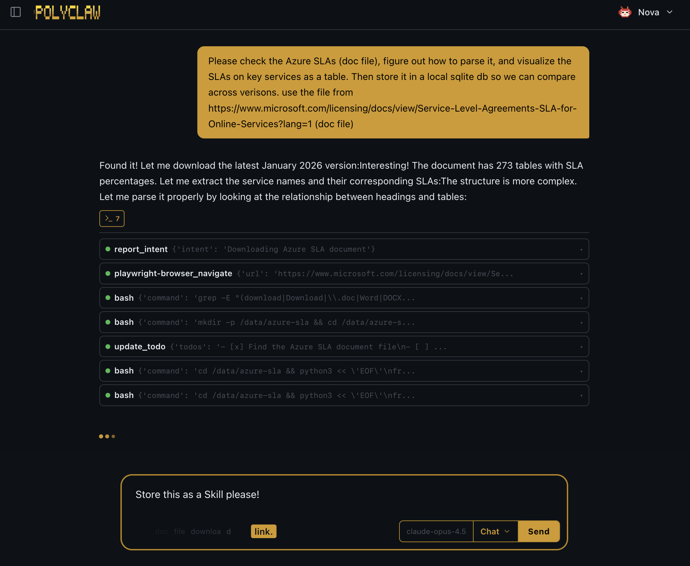
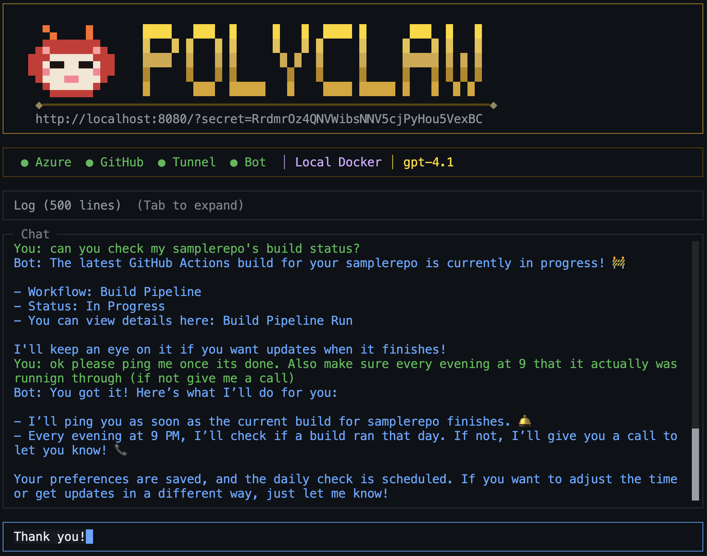

> **Note:** This project is not affiliated with or related to [octoclaw.ai](https://octoclaw.ai). The naming overlap is coincidental and was only recently brought to my attention.

<p align="center">  
  
</p>

<h1 align="center">Polyclaw</h1>

<p align="center">
  <strong>Your personal AI copilot that lives where you do -- browser, terminal, messaging apps, or a phone call.</strong>
</p>

<p align="center">
  <a href="https://github.com/aymenfurter/polyclaw/actions/workflows/ci.yml"></a>
  <a href="https://www.python.org/downloads/"></a>
  <a href="https://nodejs.org/"></a>
  <a href="https://github.com/features/copilot"></a>
  <a href="Dockerfile"></a>
  <a href="https://aymenfurter.github.io/polyclaw/"></a>
</p>

---

> **Warning:** Polyclaw is an autonomous agent that runs as you. It authenticates with your GitHub token, Azure credentials, and API keys. It can execute code, deploy infrastructure, send messages to real people, and make phone calls -- all under your identity. Understand the [risks](https://aymenfurter.github.io/polyclaw/responsible-ai/) before running it.

Polyclaw is an autonomous AI copilot built on the **GitHub Copilot SDK**. It gives you the full power of GitHub Copilot -- untethered from the IDE. It writes code, interacts with your repos via the GitHub CLI, authors its own skills at runtime, reaches out to you proactively when something matters, schedules tasks for the future, and can even call you on the phone for urgent matters.

## Why Polyclaw?

**Self-extending.** Ask it to learn something new and it writes, saves, and immediately starts using the skill -- no redeployment needed.

**Proactive.** When something important happens -- a scheduled check fails, a reminder fires, or a condition you defined is met -- it messages you on whatever channel you have connected.

**Scheduled.** Cron jobs and one-shot tasks let Polyclaw plan ahead. Daily briefings, recurring web scrapes, future reminders -- all handled autonomously.

**Voice calls.** For truly urgent matters, it calls you on the phone via Azure Communication Services and OpenAI Realtime for a live conversation with your agent.

**Extensible.** Add MCP servers, drop in plugin packs, or write skill files in Markdown. Everything is configurable from the dashboard. Ships with built-in plugins for **Microsoft Work IQ** (daily rollover, end-of-day reviews, weekly and monthly retrospectives powered by Microsoft 365 productivity data) and **Microsoft Foundry Agents** (provision Foundry resources, deploy models, and spin up ad-hoc agents with code interpreter and data analysis via the Foundry v2 Responses API).

**Memory system.** Conversations are automatically consolidated into long-term memory after idle periods. Daily topic notes and memory logs build a persistent knowledge base across sessions. Enable **Foundry IQ** as an optional retrieval layer to index memories into Azure AI Search for richer, semantically grounded recall.

**Persistent workspace.** Its own home directory survives across sessions -- files, databases, scripts, and a built-in Playwright browser for autonomous web navigation.

## Architecture

<p align="center">
  
</p>

## Intro
<p align="center">
  
https://github.com/user-attachments/assets/668ace7d-c07c-4bfd-92bd-e0d182d44343

</p>

## Web Dashboard

<p align="center">
  
</p>

## Terminal UI

<p align="center">
  
</p>

## Messaging

<p align="center">
  
</p>

## Getting Started

```bash
git clone https://github.com/aymenfurter/polyclaw.git
cd polyclaw
./scripts/run-tui.sh
```

The TUI walks you through setup, configuration, and deployment. Run locally or deploy to Azure Container Apps.

For full setup instructions, configuration reference, and feature guides, see the **[Documentation](https://aymenfurter.github.io/polyclaw/)**.

## Prerequisites

- Docker
- A GitHub account with a Copilot subscription
- An Azure subscription (needed for voice, bot channels, and Foundry integration)
- [Azure CLI](https://learn.microsoft.com/en-us/cli/azure/install-azure-cli) (if deploying to Azure)

## Security, Governance & Responsible AI

Polyclaw is in **early preview**. Security hardening is the next major focus area. Treat it as experimental software and read this section carefully.

### Understand the Risks

Polyclaw is an autonomous agent that acts without asking first -- sending messages, writing files, executing code, making API calls, and placing phone calls on your behalf. It authenticates with your GitHub token, your Azure credentials, your API keys. There is no sandbox between the agent and your accounts unless you explicitly set one up.

**What can go wrong:** unintended actions from misunderstood instructions, credential exposure via prompt injection or badly written skills, cost overruns from runaway loops provisioning Azure resources, arbitrary code execution without human review, and data leakage through conversations and tool outputs passing through configured channels.

### What We Have Built So Far

None of these controls have been formally audited. They represent a best-effort starting point.

| Layer | Mechanism |
|---|---|
| Admin API | Bearer token (`ADMIN_SECRET`) on all `/api/*` routes |
| Bot channels | JWT validation via `botbuilder-core` SDK |
| Voice callbacks | RS256 JWT validation; query-param callback token as secondary check |
| Telegram | User ID whitelist (`TELEGRAM_WHITELIST`) |
| Tunnel | `TUNNEL_RESTRICTED` limits exposure to bot/voice endpoints only |
| Secrets | Azure Key Vault via `@kv:` prefix; `ADMIN_SECRET` auto-generated if not set |
| Isolation | [Sandbox execution](https://aymenfurter.github.io/polyclaw/features/sandbox/) redirects code to isolated sessions without host access |
| Lockdown | `LOCKDOWN_MODE` rejects all admin API requests immediately |
| Transparency | Tool calls visible in chat UI, human-readable `SOUL.md`, version-controlled prompt templates, full session archives |
| Preflight | [Setup Wizard](https://aymenfurter.github.io/polyclaw/getting-started/setup-wizard/) validates JWT, tunnel, endpoints, and channel security before deployment |

### What Is Missing

- **Rate limiting.** No built-in rate limits on API calls, tool executions, or scheduled tasks.
- **Fine-grained permissions.** The agent has access to all configured credentials with no per-tool or per-skill scoping.
- **Multi-tenant isolation.** Designed for single-operator use only.

### Recommendations

1. Do not run against production accounts or infrastructure. Use scoped credentials in a test environment.
2. Set a strong `ADMIN_SECRET` and store it in a key vault.
3. Enable `TUNNEL_RESTRICTED` and `TELEGRAM_WHITELIST`.
4. Enable sandbox execution for code-running workloads.
5. Monitor logs and session archives. Do not leave the agent running unattended for extended periods.
6. Review `SOUL.md` and system prompt templates to make sure agent instructions match your expectations.

For the full assessment, see the [Security, Governance & Responsible AI](https://aymenfurter.github.io/polyclaw/responsible-ai/) documentation.

This project uses the [GitHub Copilot SDK](https://github.com/features/copilot), subject to the [GitHub Terms of Service](https://docs.github.com/en/site-policy/github-terms/github-terms-of-service), [Copilot Product Specific Terms](https://docs.github.com/en/site-policy/github-terms/github-copilot-product-specific-terms), and [Pre-release License Terms](https://docs.github.com/en/site-policy/github-terms/github-pre-release-license-terms). Not endorsed by or affiliated with GitHub, Inc.

## License

[MIT](LICENSE)
