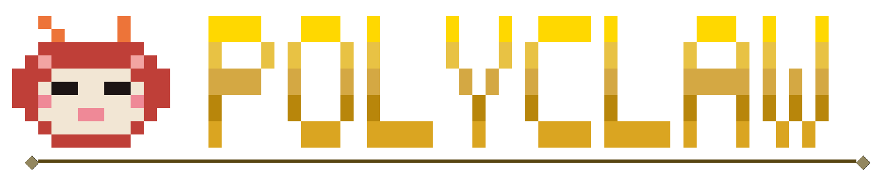

<p align="center">
  
</p>

> **Warning:** Octoclaw is an independent, community-built tool -- not an official GitHub product. It operates under your identity with a high degree of autonomy, meaning it can take actions on your behalf (GitHub, Azure, phone calls, code execution). Misconfiguration or unattended use can have real consequences. This project is intended for developers and technical users who understand the risks of running an autonomous agent with access to their accounts and infrastructure.

<p align="center">
  <strong>Your personal AI copilot that lives where you do -- browser, terminal, your messaging apps, or a phone call.</strong>
</p>

<p align="center">
  <a href="https://github.com/aymenfurter/octoclaw/actions/workflows/ci.yml"></a>
  <a href="https://www.python.org/downloads/"></a>
  <a href="https://nodejs.org/"></a>
  <a href="https://github.com/features/copilot"></a>
  <a href="Dockerfile"></a>
</p>

---

Octoclaw is an implementation similar to [OpenClaw](https://github.com/openclaw/openclaw) but built natively in the GitHub ecosystem, powered by the **GitHub Copilot SDK**. It gives you the full power of GitHub Copilot -- untethered from the IDE. It can write code, but it also uses the GitHub CLI to interact with your repos, actions, issues, and pull requests. It writes its own skills, reaches out to you when something matters, schedules tasks for the future, and can even phone you for urgent matters. Give it access to Azure and it can deploy Foundry agents or pull in business context from WorkIQ through the plugin system.

You interact with it through a web dashboard, a terminal UI, your messaging apps, or a phone call -- whichever fits the moment.

### Why Octoclaw?

**Self-extending.** Octoclaw uses GitHub Copilot to author its own skills at runtime. Ask it to learn something new and it writes, saves, and immediately starts using the skill -- no redeployment needed.

**Proactive.** Unlike a typical chatbot that waits for you, Octoclaw initiates conversations. When something important happens -- a scheduled check fails, a reminder is due, or a condition you defined is met -- it messages you on whatever channel you have connected.

**Scheduled.** Cron jobs and one-shot tasks let Octoclaw plan ahead. Set up a daily briefing, a recurring web scrape, or a future reminder, and it handles execution and delivery autonomously.

**Voice calls.** For truly urgent matters, Octoclaw can call you on the phone via Azure Communication Services and Azure OpenAI Realtime. You pick up and have a real-time voice conversation with your agent.

**Customizable.** Add your own MCP servers to give it new capabilities, drop in plugin packs to extend its knowledge, or write skill files in Markdown to shape its behavior. Everything is configurable from the admin UI.

**Persistent workspace.** Octoclaw has its own home directory that survives across sessions. It can create files, build SQLite databases, write scripts, and come back to them later. It also has its own browser via Playwright, so it can navigate the web, scrape pages, fill forms, and take screenshots autonomously.

<br/>

<table>
<tr>
<td width="50%">

### Web UI

Chat with your agent, execute multi-step tasks, browse tool calls in real time, and save results as reusable skills. The same interface handles admin functions: session management, plugin marketplace, MCP server configuration, environment deployment, and voice calling.

</td>
<td width="50%">

</td>
</tr>
<tr>
<td width="50%">

### Terminal UI

Ink-based TUI with full feature parity. Chat, manage sessions, configure settings, and deploy infrastructure without leaving the terminal.

</td>
<td width="50%">

</td>
</tr>
<tr>
<td width="50%">

### Messaging and Phone Calls

Connect your apps through Azure Bot Service for proactive messaging and rich cards. For urgent matters, Octoclaw can call you on the phone and have a real-time voice conversation.

</td>
<td width="50%">

</td>
</tr>
</table>

<br/>

## Capabilities

| | |
|---|---|
| **Self-writing skills** | Copilot authors new skills on demand -- ask it to learn something and it writes the skill file itself |
| **MCP servers** | Bring your own Model Context Protocol servers; Playwright browser automation included by default |
| **Scheduling** | Cron and one-shot tasks with autonomous execution and proactive delivery to your channels |
| **Proactive messaging** | Octoclaw reaches out to you -- no prompt required -- when conditions are met or tasks complete |
| **Voice calling** | Outbound phone calls via Azure Communication Services + Azure OpenAI Realtime for real-time conversations |
| **Plugin system** | Drop-in plugin packs (Foundry Agents, GitHub Status, Wikipedia, Second Brain/WorkIQ, and custom) |
| **Skill library** | Web search, URL summarization, daily briefing, note-taking; user-defined skills via Markdown |
| **Memory** | Daily journals, topic-based memory files, and optional Azure AI Search indexing |
| **Personality** | Customizable identity (SOUL.md), emotional state, name, location, and user preferences |
| **Sandboxed execution** | Optional container-isolated code execution with tool interception |
| **Infrastructure provisioning** | One-click Azure Bot + Cloudflare Tunnel setup from the admin UI |

## Getting started

```bash
git clone https://github.com/aymenfurter/octoclaw.git
cd octoclaw
./scripts/run-tui.sh
```

The TUI guides you through setup, configuration, and deployment. From there you can run Octoclaw locally or deploy to Azure Container Apps.

## Extending

### Plugins

Drop a folder with a `PLUGIN.json` into `plugins/`. Bundled plugins:

| Plugin | Description |
|---|---|
| **foundry-agents** | Azure AI Foundry agent integration |
| **github-status** | GitHub status checks and notifications |
| **wikipedia-lookup** | Wikipedia article search and summarization |
| **second-brain-workiq** | WorkIQ / Second Brain knowledge base |

### Skills

Skills are Markdown files (`SKILL.md`) in the `skills/` directory. Built-in:

| Skill | Description |
|---|---|
| **daily-briefing** | Morning summary from memory and scheduled tasks |
| **note-taking** | Capture and organize notes into topic-based memory |
| **summarize-url** | Fetch and summarize a web page |
| **web-search** | Web searches using Playwright |

Add custom skills to `~/.octoclaw/skills/`.

## Development

```bash
pytest app/runtime/tests/ -q --tb=short   # backend tests
cd app/frontend && npm run build           # frontend type-check + build
```

## Prerequisites

- Docker
- A GitHub account with a Copilot subscription
- An Azure subscription (for voice calling, bot provisioning, and Foundry integration)
- [Azure CLI](https://learn.microsoft.com/en-us/cli/azure/install-azure-cli)

## Risks

Let's be real about what this thing does.

Octoclaw runs as **you**. It authenticates with your GitHub token, your Azure credentials, your API keys. When it pushes code, opens a PR, or deploys infrastructure -- that's your identity on every commit and every API call. There is no sandbox between the agent and your accounts unless you explicitly set one up.

It can execute arbitrary code on its host. It has a browser. It can make outbound network requests, write files, and call external services. If you give it access to Azure, it can provision real resources that cost real money. If you connect it to a messaging channel, it can send messages to real people. If you give it a phone number, it can make real phone calls.

The Copilot SDK usage consumes your GitHub Copilot allowance. Scheduled tasks and proactive loops can burn through it fast. The admin UI exposes agent controls over HTTP -- if you don't set a strong `ADMIN_SECRET` and enable `LOCKDOWN_MODE`, anyone who finds your endpoint owns your agent.

AI-generated output can be wrong, misleading, or inappropriate. The agent does not understand consequences the way you do. Review what it produces before trusting it.

This project uses the [GitHub Copilot SDK](https://github.com/features/copilot), subject to the [GitHub Terms of Service](https://docs.github.com/en/site-policy/github-terms/github-terms-of-service), [Copilot Product Specific Terms](https://docs.github.com/en/site-policy/github-terms/github-copilot-product-specific-terms), and [Pre-release License Terms](https://docs.github.com/en/site-policy/github-terms/github-pre-release-license-terms). It is not an official GitHub product. Not endorsed by or affiliated with GitHub, Inc. or Microsoft Corporation.

Should you run this? Can you do some epic sh*t with it? Absolutely.

## License

[MIT](LICENSE)
